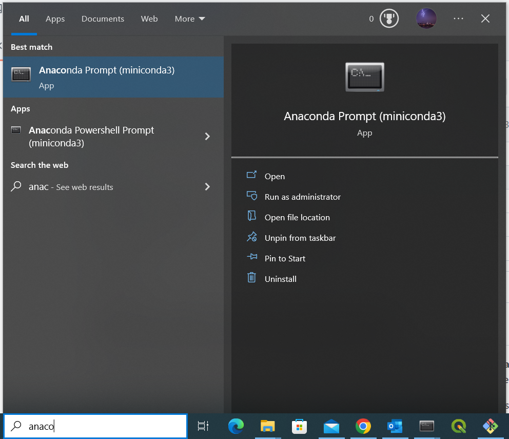
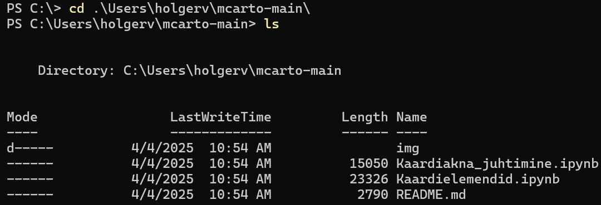
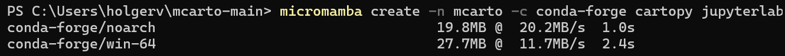
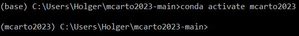
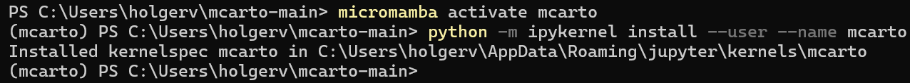
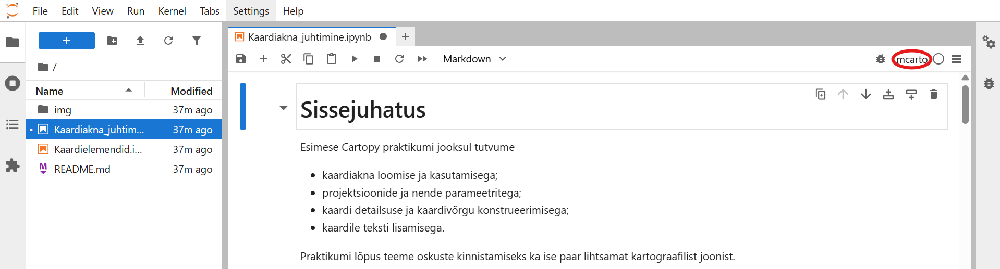

# Matemaatiline kartograafia 2023
Antud juhendid toetavad geograafia eriala magistriõppe kursust <b>Matemaatiline kartograafia LOOM.02.007</b> ja keskenduvad Pythoni matemaatilise kartograafia ja visualiseerimise teegi [Cartopy](https://scitools.org.uk/cartopy/docs/latest/) võimalustele.

Esimene juhend annab ülevaate kaardiakna loomisest, erinevate projektsioonide kasutamisest ja lihtsamate kaardielementide (kaardivõrk, tekst) konstrueerimisest:
* https://github.com/LandscapeGeoinformatics/mcarto2023/blob/main/Kaardiakna_juhtimine.ipynb

Teine juhend keskendub täiendavate kaardielementide lisamisele, mille hulka kuuluvad nii lisadetailid (punkttähised, tekst ja legend) kui erinevad matemaatilised ja kartograafilised konstruktsioonid (ortodroom jms):
* https://github.com/LandscapeGeoinformatics/mcarto2023/blob/main/Kaardielemendid.ipynb

## Ettevalmistus
Juhendite kasutamine eeldab [Anaconda](https://conda.io/en/main/miniconda.html) olemasolu, mis peaks olema arvutiklassi arvutites tagatud. Kes soovib seda seadistada oma arvutis, võib selleks kasutada Alex Kmochi vastavat [juhendit](https://kodu.ut.ee/~kmoch/geopython2020/L0/Installing_Miniconda_GIS.html).

Pärast Anaconda installimist laadi alla ja paki kuhugi kausta lahti käesolev repositoorium koos kõigi failidega.

`Code -> Download ZIP`

Seejärel leia ja ava käsurea kaudu nn Anaconda Prompt.

Liigu käsu `cd` abil kausta, kuhu pakkisid eelnevalt lahti GitHubist alla laaditud ZIP faili.

`cd C:\Users\Holger\mcarto2023-main\mcarto2023-main`

Käsu `ls` abil peaks nähtavale tulema kausta sisu, sh praktikumis kasutatavad Jupyteri töövihikud.

Alustuseks loome Anaconda keskkonna nimega `mcarto2023` ning installime sellesse `cartopy` ja `jupyterlab` teegid, mida kasutame praktikumi ülesannetes. Parameeter `-c conda-forge` määrab Pythoni teekide lähtekanaliks [conda-forge](https://conda-forge.org/) repositooriumi.

`conda create -n mcarto2023 -c conda-forge cartopy jupyterlab`

Järgmine rida aktiveerib äsjaloodud keskkonna.

`conda activate mcarto2023`

Enne harjutuste kallale asumist installime veel nn Jupyteri kerneli ehk anname Jupyteri töövihikutele teada, et soovime nende jooksutamisel kasutada vastloodud `mcarto2023` keskkonda.

`python -m ipykernel install --user --name mcarto2023`

Lõpuks aktiveeri Jupyteri keskkond.

`jupyter lab`

Avaneb brauser, kus klõps failil laiendiga *.ipynb* avab vastava töövihiku, mida saab brauseri aknas kasutama hakata.

