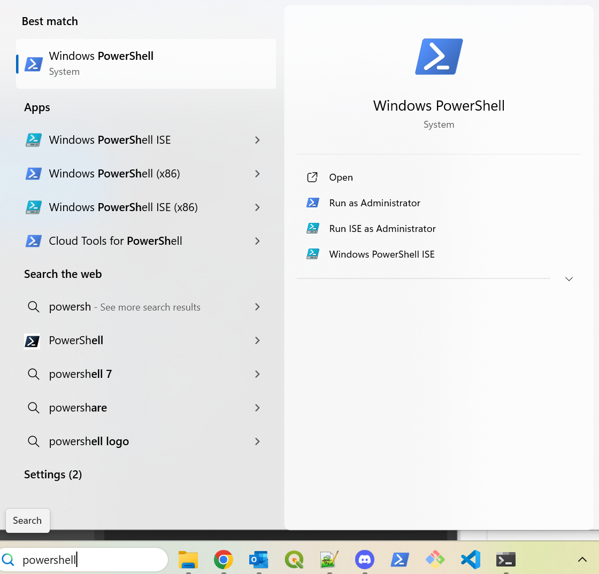

# Matemaatiline kartograafia

Antud juhendid toetavad geograafia eriala magistriõppe kursust <b>Matemaatiline kartograafia LOOM.02.007</b> ja keskenduvad Pythoni matemaatilise kartograafia ja visualiseerimise teegi [Cartopy](https://scitools.org.uk/cartopy/docs/latest/) võimalustele.

Esimene juhend annab ülevaate kaardiakna loomisest, erinevate projektsioonide kasutamisest ja lihtsamate kaardielementide (kaardivõrk, tekst) konstrueerimisest:
* [Kaardiakna_juhtimine.ipynb](https://github.com/LandscapeGeoinformatics/mcarto/blob/main/Kaardiakna_juhtimine.ipynb)

Teine juhend keskendub täiendavate kaardielementide lisamisele, mille hulka kuuluvad nii lisadetailid (punkttähised, tekst ja legend) kui erinevad matemaatilised ja kartograafilised konstruktsioonid (ortodroom jms):
* [Kaardielemendid.ipynb](https://github.com/LandscapeGeoinformatics/mcarto/blob/main/Kaardielemendid.ipynb)

## Ettevalmistus

Juhendite kasutamine eeldab [Micromamba](https://mamba.readthedocs.io/en/latest/) olemasolu, mis peaks olema arvutiklassi arvutites tagatud. Kes soovib seda seadistada oma arvutis, võib selleks kasutada Alex Kmochi vastavat [juhendit](https://kodu.ut.ee/~kmoch/geopython2023/Py_00/Installing_Micromamba.html).

Pärast Micromamba installimist laadi alla ja paki kuhugi kausta lahti käesolev repositoorium koos kõigi failidega.

`Code -> Download ZIP`

Seejärel leia ja ava käsurea kaudu Windows PowerShell.

Liigu käsu `cd` abil kausta, kuhu pakkisid eelnevalt lahti GitHubist alla laaditud ZIP faili.

`cd C:\Users\Holger\mcarto-main\mcarto-main`

Käsu `ls` (Windowsis ka käsk `dir`) abil peaks nähtavale tulema kausta sisu, sh praktikumis kasutatavad Jupyteri töövihikud.

Alustuseks loome keskkonna nimega `mcarto2025` ning installime sellesse `cartopy` ja `jupyterlab` teegid, mida kasutame praktikumi ülesannetes. Parameeter `-c conda-forge` määrab Pythoni teekide lähtekanaliks [conda-forge](https://conda-forge.org/) repositooriumi.

`micromamba create -n mcarto2025 -c conda-forge cartopy jupyterlab`

Järgmine rida aktiveerib äsjaloodud keskkonna.

`micromamba activate mcarto2025`

Enne harjutuste kallale asumist installime veel nn Jupyteri kerneli ehk anname Jupyteri töövihikutele teada, et soovime nende jooksutamisel kasutada vastloodud `mcarto2025` keskkonda.

`python -m ipykernel install --user --name mcarto2025`

Lõpuks aktiveeri Jupyteri keskkond.

`jupyter lab`

Avaneb brauser, kus klõps failil laiendiga *.ipynb* avab vastava töövihiku, mida saab brauseri aknas kasutama hakata.

